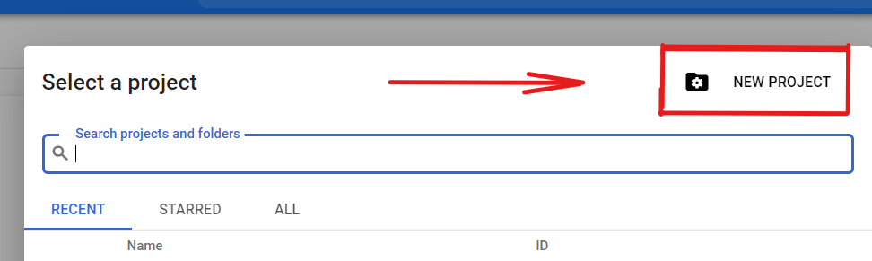
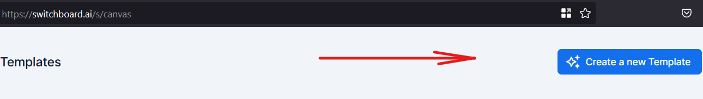
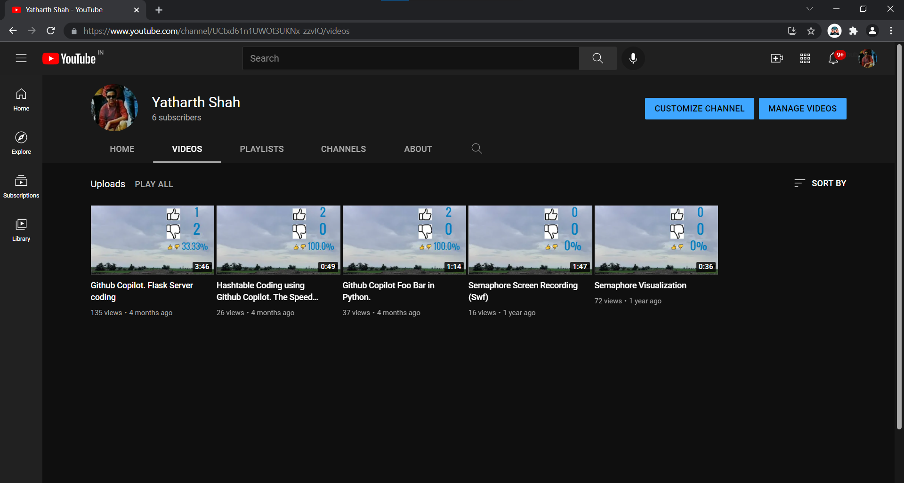

# How to update Youtube video thumbnail with the dislikes count fetched using the Youtube API
## Prerequisites:
- []: # Language: Any that can send HTTP requests
- []: # Youtube Client Secrets file
- []: # Switchboard API key
- []: # Youtube Channel ID

## List of steps we will follow:
1. Create a new project in [Google Cloud Platform](https://console.cloud.google.com). Since we have to use the [Google Cloud SDK](https://cloud.google.com/sdk/docs/quickstart-cli) to access the Youtube API, we will create a new project and add the Google Cloud SDK to it.
2. Download the Youtube Client Secrets file from the Console.
3. Fetch the Switchboard API key from [Switchboard](https://switchboard.ai).
4. Fetch the Youtube Channel ID from the Youtube Studio.
5. Set the Switchboard API key as an environment variable.
6. Fetch the list of videos from the Youtube API.
7. Fetch their likes and dislikes count from the Youtube API.
8. Fetch a thumbnail with the like and dislikes count from the Switchboard API.
9. Update the thumbnail of the video in the Youtube API.

### Step 1: Create a new project in Google Cloud Platform
Go to [Google Cloud Platform](https://console.cloud.google.com) and create a new project.



Configure it to use Youtube API V3.
### Step 2: Download the Youtube Client Secrets file from the Console
Go to [Google Cloud Platform](https://console.cloud.google.com) and click on the project you created in the previous step. Click on the **APIs & auth** tab. Click on the **Credentials** button. Click on the **Create credentials** button. Click on the **OAuth client ID** button. Click on the **Create** button. Click on the **Download JSON** button. Save the file in the same directory as this tutorial.

### Step 3: Fetch the Switchboard API key from Switchboard
Go to [Switchboard](https://switchboard.ai) and click on the **API** tab. Click on the **API Key** button. Copy the API key and save it in the form of an environment variable.

### Step 4: Create a new template in Switchboard Canvas
Go to [Canvas](https://switchboard.ai/s/canvas) and create a new template with your preferences.



### Step 5: Authenticating your user in Google cloud
Go to console, and in that add the email of the user that is going to use your app.

### Step 6: The code:

#### A: Fetching Data from Youtube
For this, we first ```pip install``` the libraries, and then use them in our code.

#### B: Generating the thumbnail from Switchboard
For this, we refer to the names and types of input in setting up of the template. From that, we then pass the data to Switchboard API, and parse the URL of the image generated from the response. Then we fetch the image from the URL, and save it in the local file. For our simplicity, we save the image with it's name being the VideoID.

#### C: Pushing the thumbnail to Youtube
After saving the image on local storage, we again use the Youtube API, and push the image to be the thumbnail.

### The code can be found [here](https://github.com/yatharth9/yt-dislikes-thumbnail/blob/main/Switchboard/ThumbnailUpdate.py)

### Step 7: Putting the Authentication
After the code is written, to execute the app, you need to allow it access to your data. Your code will output a link to the output, which when opened in a browser will ask you if you want to allow the app access to your data. After accepting, you will have to copy the code shown in the browser, and paste it into the terminal.

### Step 8: Seeing the change reflected
Now, you can see the thumbnails on your Youtube videos being updated with the likes, dislikes and ratio.



### Note:
This code will only work for the Public videos on your channel, and it will not work for unlisted or Private videos.
